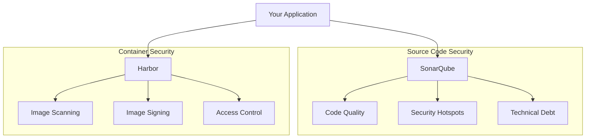

# Complete DevSecOps Toolchain for GitHub Actions + Harbor

A comprehensive guide to building a mature DevSecOps pipeline using GitHub Actions and Harbor as the container registry.

---

## Table of Contents

- [Harbor vs SonarQube](#harbor-vs-sonarqube--different-domains)
- [Complete Toolchain Overview](#complete-devsecops-toolchain)
  - [Pre-Commit](#pre-commit-developer-workstation)
  - [SAST](#sast-static-application-security-testing)
  - [SCA](#sca-software-composition-analysis)
  - [IaC Security](#iac-security)
  - [Container Security](#container-security)
  - [DAST](#dast-dynamic-application-security-testing)
  - [API Security](#api-security)
  - [Runtime Security](#runtime-security)
- [Recommended Minimal Stack](#recommended-minimal-devsecops-stack)
- [GitHub Actions Workflow](#github-actions-workflow-implementation)
- [Summary](#summary-what-you-need)

---

## Harbor vs SonarQube — Different Domains

> **Key Insight:** Harbor and SonarQube serve completely different purposes. You need both.

| Tool | What It Does | What It Doesn't Do |
|------|--------------|-------------------|
| **Harbor** | Container registry, image vulnerability scanning, image signing, access control | Doesn't analyze source code, doesn't find application logic bugs |
| **SonarQube** | Static code analysis, code quality, bugs, code smells, security hotspots | Doesn't scan container images, doesn't check runtime vulnerabilities |



---

## Complete DevSecOps Toolchain

### Pre-Commit (Developer Workstation)

Security starts before code leaves the developer's machine.

| Purpose | Tool Options | Notes |
|---------|--------------|-------|
| Secret scanning | [gitleaks](https://github.com/gitleaks/gitleaks), [git-secrets](https://github.com/awslabs/git-secrets), [truffleHog](https://github.com/trufflesecurity/trufflehog) | Prevents credentials from being committed |
| Linting/formatting | [pre-commit](https://pre-commit.com/), language-specific linters | Catches issues early |
| Fast SAST | [Semgrep](https://semgrep.dev/) (local rules) | Quick feedback loop |

**Example `.pre-commit-config.yaml`:**

```yaml
repos:
  - repo: https://github.com/gitleaks/gitleaks
    rev: v8.18.0
    hooks:
      - id: gitleaks
      
  - repo: https://github.com/semgrep/semgrep
    rev: v1.50.0
    hooks:
      - id: semgrep
        args: ['--config', 'auto']
```

---

### SAST (Static Application Security Testing)

> **Recommendation:** Semgrep for fast PR feedback + SonarQube for comprehensive analysis and quality gates.

| Tool | Strengths | Considerations |
|------|-----------|----------------|
| [SonarQube](https://www.sonarqube.org/) | Code quality + security, IDE integration, technical debt tracking | Self-hosted complexity, commercial for advanced features |
| [Semgrep](https://semgrep.dev/) | Fast, custom rules, excellent pattern matching | Less deep data-flow analysis than CodeQL |
| [CodeQL](https://codeql.github.com/) | Deep data-flow analysis, free for public repos | Slow on large codebases, limited language support |
| [Checkmarx](https://checkmarx.com/) | Enterprise-grade, comprehensive | Expensive, can be noisy |
| [Snyk Code](https://snyk.io/product/snyk-code/) | Fast, good accuracy, SaaS | Commercial |

**When to Use Each:**

```
PR Opened/Updated     →  Semgrep (fast, <2 min)
Merge to Main         →  SonarQube (comprehensive, quality gate)
Nightly Schedule      →  CodeQL (deep analysis)
```

---

### SCA (Software Composition Analysis)

> **Recommendation:** Trivy (covers SCA + containers + IaC) + Snyk for deeper analysis.

| Tool | Strengths |
|------|-----------|
| [Snyk](https://snyk.io/) | Best-in-class vulnerability database, automated fix PRs |
| [Grype](https://github.com/anchore/grype) | Fast, open source, pairs with Syft for SBOM |
| [Trivy](https://github.com/aquasecurity/trivy) | Multi-purpose: SCA, containers, IaC in one tool |
| [Dependabot](https://github.com/dependabot) | Native GitHub integration, good baseline |
| [OWASP Dependency-Check](https://owasp.org/www-project-dependency-check/) | Free, comprehensive, NVD-based |

**Trivy Multi-Scanner Capability:**

```bash
# Single tool, multiple scan types
trivy fs .                    # SCA - dependencies
trivy image myapp:latest      # Container vulnerabilities
trivy config ./terraform      # IaC misconfigurations
trivy sbom ./sbom.json        # SBOM analysis
```

---

### IaC Security

> **Recommendation:** Checkov or Trivy (if already using Trivy for containers).

| Tool | Coverage |
|------|----------|
| [Checkov](https://www.checkov.io/) | Terraform, CloudFormation, K8s, Helm, Dockerfile, ARM |
| [Trivy](https://github.com/aquasecurity/trivy) | Same coverage, unified scanning experience |
| [tfsec](https://github.com/aquasecurity/tfsec) | Terraform-specific, very fast |
| [KICS](https://kics.io/) | Broad coverage, open source (Checkmarx) |
| [Terrascan](https://runterrascan.io/) | OPA-based policies, multi-cloud |

**Common Misconfigurations Caught:**

- [ ] S3 buckets with public access
- [ ] Security groups with 0.0.0.0/0 ingress
- [ ] Unencrypted storage volumes
- [ ] Overly permissive IAM policies
- [ ] Missing resource tags
- [ ] Kubernetes pods running as root

---

### Container Security

| Stage | Tool | Purpose |
|-------|------|---------|
| **Build-time scanning** | [Trivy](https://github.com/aquasecurity/trivy), [Grype](https://github.com/anchore/grype) | Scan before push |
| **Registry** | [Harbor](https://goharbor.io/) | Centralized scanning, policy enforcement |
| **Signing** | [Cosign](https://github.com/sigstore/cosign) | Cryptographic provenance |
| **SBOM** | [Syft](https://github.com/anchore/syft) | Software bill of materials |
| **Admission Control** | [Kyverno](https://kyverno.io/), [Gatekeeper](https://github.com/open-policy-agent/gatekeeper) | Enforce policies at deploy time |

**Container Security Flow:**

```
┌─────────────────────────────────────────────────────────────┐
│  BUILD STAGE                                                │
│  ┌─────────┐    ┌─────────┐    ┌─────────┐    ┌─────────┐  │
│  │  Build  │ → │  Trivy  │ → │  Syft   │ → │ Cosign  │  │
│  │  Image  │    │  Scan   │    │  SBOM   │    │  Sign   │  │
│  └─────────┘    └─────────┘    └─────────┘    └─────────┘  │
└─────────────────────────────────────────────────────────────┘
                          │
                          ▼
┌─────────────────────────────────────────────────────────────┐
│  HARBOR REGISTRY                                            │
│  • Deep vulnerability scan (Trivy)                          │
│  • Policy evaluation (block CRITICAL/HIGH)                  │
│  • Signature verification                                   │
│  • Immutable tags                                           │
│  • SBOM storage                                             │
└─────────────────────────────────────────────────────────────┘
                          │
                          ▼
┌─────────────────────────────────────────────────────────────┐
│  KUBERNETES ADMISSION                                       │
│  • Kyverno/Gatekeeper validates:                            │
│    ├── Image signed by trusted key                          │
│    ├── Image from Harbor only (no Docker Hub)               │
│    ├── Scan passed within last 24 hours                     │
│    └── No CRITICAL vulnerabilities                          │
└─────────────────────────────────────────────────────────────┘
```

---

### DAST (Dynamic Application Security Testing)

> **Recommendation:** OWASP ZAP for comprehensive DAST + Nuclei for known vulnerability checks.

| Tool | Strengths |
|------|-----------|
| [OWASP ZAP](https://www.zaproxy.org/) | Free, comprehensive, excellent CI integration |
| [Nuclei](https://github.com/projectdiscovery/nuclei) | Fast, template-based, great for known CVEs |
| [StackHawk](https://www.stackhawk.com/) | Developer-friendly, good CI integration |
| [Burp Suite Enterprise](https://portswigger.net/burp/enterprise) | Gold standard for DAST, expensive |
| [Nikto](https://github.com/sullo/nikto) | Web server scanner, lightweight |

**DAST Execution Strategy:**

```yaml
# Run DAST after deployment to staging
Staging Deploy Complete
        │
        ▼
┌───────────────────┐
│   OWASP ZAP       │  ← Full spider + active scan
│   (15-30 min)     │
└───────────────────┘
        │
        ▼
┌───────────────────┐
│   Nuclei          │  ← Known CVE templates
│   (2-5 min)       │
└───────────────────┘
        │
        ▼
   Results → SARIF → GitHub Security Tab
```

---

### API Security

| Tool | Purpose |
|------|---------|
| [StackHawk](https://www.stackhawk.com/) | OpenAPI-aware scanning, CI-native |
| [42Crunch](https://42crunch.com/) | API contract security, schema validation |
| [Postman](https://www.postman.com/) | API testing with security checks |
| [OWASP ZAP](https://www.zaproxy.org/) | OpenAPI import for targeted scanning |

**API Security Checklist:**

- [ ] Authentication/authorization testing
- [ ] Input validation fuzzing
- [ ] Rate limiting verification
- [ ] CORS misconfiguration detection
- [ ] Sensitive data exposure checks
- [ ] Broken object-level authorization (BOLA)

---

### Runtime Security

| Tool | Purpose |
|------|---------|
| [Falco](https://falco.org/) | Runtime threat detection, syscall monitoring |
| [Sysdig](https://sysdig.com/) | Container monitoring + security, commercial |
| [Aqua](https://www.aquasec.com/) | Full container lifecycle security |
| [Wazuh](https://wazuh.com/) | Host-based intrusion detection (HIDS) |

**Falco Example Rules:**

```yaml
# Detect shell spawned in container
- rule: Shell Spawned in Container
  desc: Detect shell execution in container
  condition: >
    spawned_process and 
    container and 
    proc.name in (bash, sh, zsh)
  output: >
    Shell spawned in container 
    (user=%user.name container=%container.name shell=%proc.name)
  priority: WARNING

# Detect sensitive file access
- rule: Read Sensitive File
  desc: Detect reads to sensitive files
  condition: >
    open_read and 
    container and 
    fd.name in (/etc/shadow, /etc/passwd)
  output: >
    Sensitive file read 
    (user=%user.name file=%fd.name container=%container.name)
  priority: CRITICAL
```

---

## Recommended Minimal DevSecOps Stack

```
┌─────────────────────────────────────────────────────────────┐
│  PRE-COMMIT                                                 │
│  └── gitleaks (secrets)                                     │
├─────────────────────────────────────────────────────────────┤
│  GITHUB ACTIONS - PR CHECKS                                 │
│  ├── Semgrep (fast SAST)                                    │
│  ├── Trivy (SCA + IaC + Container)                          │
│  └── Unit tests with coverage                               │
├─────────────────────────────────────────────────────────────┤
│  GITHUB ACTIONS - MERGE TO MAIN                             │
│  ├── SonarQube (deep SAST + quality gate)                   │
│  ├── Build container image                                  │
│  ├── Trivy scan (fail on CRITICAL/HIGH)                     │
│  ├── Syft SBOM generation                                   │
│  ├── Cosign signing                                         │
│  └── Push to Harbor                                         │
├─────────────────────────────────────────────────────────────┤
│  HARBOR                                                     │
│  ├── Deep Trivy scan                                        │
│  ├── Policy enforcement                                     │
│  └── Signature verification                                 │
├─────────────────────────────────────────────────────────────┤
│  POST-DEPLOYMENT (Staging)                                  │
│  ├── OWASP ZAP (DAST)                                       │
│  └── Nuclei (known CVE checks)                              │
├─────────────────────────────────────────────────────────────┤
│  KUBERNETES                                                 │
│  ├── Kyverno (admission control)                            │
│  └── Falco (runtime detection)                              │
├─────────────────────────────────────────────────────────────┤
│  CONTINUOUS                                                 │
│  ├── Snyk (continuous monitoring)                           │
│  └── Splunk (audit logs, SIEM)                              │
└─────────────────────────────────────────────────────────────┘
```

---

## GitHub Actions Workflow Implementation

### Complete Pipeline

```yaml
name: DevSecOps Pipeline

on:
  push:
    branches: [main]
  pull_request:
    branches: [main]

permissions:
  contents: read
  security-events: write
  packages: write
  id-token: write

env:
  HARBOR_REGISTRY: harbor.example.com
  IMAGE_NAME: myapp

jobs:
  # ============================================
  # SAST - Static Analysis
  # ============================================
  semgrep:
    name: Semgrep SAST
    runs-on: ubuntu-latest
    steps:
      - uses: actions/checkout@v4
      
      - name: Semgrep Scan
        uses: semgrep/semgrep-action@v1
        with:
          config: >-
            p/security-audit
            p/secrets
            p/owasp-top-ten
            
      - name: Upload SARIF
        uses: github/codeql-action/upload-sarif@v3
        if: always()
        with:
          sarif_file: semgrep.sarif

  sonarqube:
    name: SonarQube Analysis
    runs-on: ubuntu-latest
    if: github.event_name == 'push'
    steps:
      - uses: actions/checkout@v4
        with:
          fetch-depth: 0
          
      - name: SonarQube Scan
        uses: SonarSource/sonarqube-scan-action@v2
        env:
          SONAR_TOKEN: ${{ secrets.SONAR_TOKEN }}
          SONAR_HOST_URL: ${{ secrets.SONAR_HOST_URL }}
          
      - name: Quality Gate
        uses: SonarSource/sonarqube-quality-gate-action@v1
        timeout-minutes: 5
        env:
          SONAR_TOKEN: ${{ secrets.SONAR_TOKEN }}

  # ============================================
  # SCA - Dependency Scanning
  # ============================================
  trivy-sca:
    name: Trivy SCA
    runs-on: ubuntu-latest
    steps:
      - uses: actions/checkout@v4
      
      - name: Trivy Dependency Scan
        uses: aquasecurity/trivy-action@master
        with:
          scan-type: 'fs'
          scan-ref: '.'
          format: 'sarif'
          output: 'trivy-sca.sarif'
          severity: 'CRITICAL,HIGH'
          
      - name: Upload SARIF
        uses: github/codeql-action/upload-sarif@v3
        with:
          sarif_file: 'trivy-sca.sarif'

  # ============================================
  # IaC Security
  # ============================================
  checkov:
    name: Checkov IaC Scan
    runs-on: ubuntu-latest
    steps:
      - uses: actions/checkout@v4
      
      - name: Checkov Scan
        uses: bridgecrewio/checkov-action@v12
        with:
          directory: .
          framework: terraform,kubernetes,dockerfile
          output_format: sarif
          output_file_path: checkov.sarif
          soft_fail: false
          
      - name: Upload SARIF
        uses: github/codeql-action/upload-sarif@v3
        with:
          sarif_file: 'checkov.sarif'

  # ============================================
  # Container Build & Security
  # ============================================
  build-and-push:
    name: Build, Scan, Sign, Push
    runs-on: ubuntu-latest
    needs: [semgrep, trivy-sca, checkov]
    if: github.event_name == 'push'
    outputs:
      image-digest: ${{ steps.push.outputs.digest }}
    
    steps:
      - uses: actions/checkout@v4
      
      - name: Set up Docker Buildx
        uses: docker/setup-buildx-action@v3
        
      - name: Build Image
        uses: docker/build-push-action@v5
        with:
          context: .
          load: true
          tags: ${{ env.IMAGE_NAME }}:${{ github.sha }}
          
      - name: Trivy Container Scan
        uses: aquasecurity/trivy-action@master
        with:
          image-ref: '${{ env.IMAGE_NAME }}:${{ github.sha }}'
          format: 'sarif'
          output: 'trivy-container.sarif'
          severity: 'CRITICAL,HIGH'
          exit-code: '1'
          
      - name: Upload Container Scan SARIF
        uses: github/codeql-action/upload-sarif@v3
        if: always()
        with:
          sarif_file: 'trivy-container.sarif'
          
      - name: Generate SBOM
        uses: anchore/sbom-action@v0
        with:
          image: ${{ env.IMAGE_NAME }}:${{ github.sha }}
          format: spdx-json
          output-file: sbom.spdx.json
          
      - name: Login to Harbor
        uses: docker/login-action@v3
        with:
          registry: ${{ env.HARBOR_REGISTRY }}
          username: ${{ secrets.HARBOR_USERNAME }}
          password: ${{ secrets.HARBOR_PASSWORD }}
          
      - name: Push to Harbor
        id: push
        run: |
          docker tag ${{ env.IMAGE_NAME }}:${{ github.sha }} \
            ${{ env.HARBOR_REGISTRY }}/${{ env.IMAGE_NAME }}:${{ github.sha }}
          docker push ${{ env.HARBOR_REGISTRY }}/${{ env.IMAGE_NAME }}:${{ github.sha }}
          
          # Get digest
          DIGEST=$(docker inspect --format='{{index .RepoDigests 0}}' \
            ${{ env.HARBOR_REGISTRY }}/${{ env.IMAGE_NAME }}:${{ github.sha }} | cut -d@ -f2)
          echo "digest=$DIGEST" >> $GITHUB_OUTPUT
          
      - name: Install Cosign
        uses: sigstore/cosign-installer@v3
        
      - name: Sign Image (Keyless)
        run: |
          cosign sign --yes \
            ${{ env.HARBOR_REGISTRY }}/${{ env.IMAGE_NAME }}@${{ steps.push.outputs.digest }}
        env:
          COSIGN_EXPERIMENTAL: 1
          
      - name: Attach SBOM to Image
        run: |
          cosign attach sbom \
            --sbom sbom.spdx.json \
            ${{ env.HARBOR_REGISTRY }}/${{ env.IMAGE_NAME }}@${{ steps.push.outputs.digest }}
            
      - name: Upload SBOM Artifact
        uses: actions/upload-artifact@v4
        with:
          name: sbom
          path: sbom.spdx.json

  # ============================================
  # Deploy to Staging
  # ============================================
  deploy-staging:
    name: Deploy to Staging
    runs-on: ubuntu-latest
    needs: [build-and-push]
    environment: staging
    steps:
      - uses: actions/checkout@v4
      
      # Add your deployment steps here
      - name: Deploy to Kubernetes
        run: |
          echo "Deploying ${{ env.HARBOR_REGISTRY }}/${{ env.IMAGE_NAME }}:${{ github.sha }}"
          # kubectl set image deployment/myapp ...

  # ============================================
  # DAST - After Staging Deployment
  # ============================================
  dast:
    name: DAST Scan
    runs-on: ubuntu-latest
    needs: [deploy-staging]
    
    steps:
      - uses: actions/checkout@v4
      
      - name: Wait for Deployment
        run: sleep 30  # Wait for pods to be ready
      
      - name: OWASP ZAP Full Scan
        uses: zaproxy/action-full-scan@v0.9.0
        with:
          target: 'https://staging.example.com'
          rules_file_name: '.zap/rules.tsv'
          fail_action: true
          artifact_name: 'zap-report'
          
      - name: Nuclei Scan
        uses: projectdiscovery/nuclei-action@main
        with:
          target: 'https://staging.example.com'
          templates: 'cves,vulnerabilities,misconfigurations'
          sarif-export: nuclei.sarif
          
      - name: Upload Nuclei SARIF
        uses: github/codeql-action/upload-sarif@v3
        if: always()
        with:
          sarif_file: 'nuclei.sarif'

  # ============================================
  # Security Summary
  # ============================================
  security-summary:
    name: Security Summary
    runs-on: ubuntu-latest
    needs: [semgrep, trivy-sca, checkov, build-and-push, dast]
    if: always()
    steps:
      - name: Security Gate Status
        run: |
          echo "## Security Scan Summary" >> $GITHUB_STEP_SUMMARY
          echo "" >> $GITHUB_STEP_SUMMARY
          echo "| Check | Status |" >> $GITHUB_STEP_SUMMARY
          echo "|-------|--------|" >> $GITHUB_STEP_SUMMARY
          echo "| Semgrep SAST | ${{ needs.semgrep.result }} |" >> $GITHUB_STEP_SUMMARY
          echo "| Trivy SCA | ${{ needs.trivy-sca.result }} |" >> $GITHUB_STEP_SUMMARY
          echo "| Checkov IaC | ${{ needs.checkov.result }} |" >> $GITHUB_STEP_SUMMARY
          echo "| Container Scan | ${{ needs.build-and-push.result }} |" >> $GITHUB_STEP_SUMMARY
          echo "| DAST | ${{ needs.dast.result }} |" >> $GITHUB_STEP_SUMMARY
```

### Kyverno Admission Policy

```yaml
# kyverno-policies/require-signed-images.yaml
apiVersion: kyverno.io/v1
kind: ClusterPolicy
metadata:
  name: require-signed-images
spec:
  validationFailureAction: Enforce
  background: true
  rules:
    - name: verify-signature
      match:
        any:
          - resources:
              kinds:
                - Pod
      verifyImages:
        - imageReferences:
            - "harbor.example.com/*"
          attestors:
            - entries:
                - keyless:
                    subject: "https://github.com/myorg/*"
                    issuer: "https://token.actions.githubusercontent.com"
                    
    - name: require-harbor-registry
      match:
        any:
          - resources:
              kinds:
                - Pod
      validate:
        message: "Images must come from Harbor registry"
        pattern:
          spec:
            containers:
              - image: "harbor.example.com/*"
```

---

## Summary: What You Need

| Category | Minimum (Free/OSS) | Recommended | Enterprise |
|----------|-------------------|-------------|------------|
| **Pre-commit** | gitleaks | gitleaks + pre-commit | + commercial hooks |
| **SAST** | Semgrep | Semgrep + SonarQube | Checkmarx, Snyk Code |
| **SCA** | Trivy | Trivy + Snyk | Snyk, Black Duck |
| **IaC** | Checkov | Checkov | Prisma Cloud |
| **Container Registry** | Harbor | Harbor + Cosign | Harbor + Notary |
| **SBOM** | Syft | Syft | Anchore Enterprise |
| **DAST** | OWASP ZAP | ZAP + Nuclei | Burp Enterprise |
| **API Security** | ZAP | StackHawk | 42Crunch |
| **Runtime** | Falco | Falco | Sysdig, Aqua |
| **Admission Control** | Kyverno | Kyverno | + OPA/Gatekeeper |
| **SIEM/Logging** | — | Splunk | Splunk + SOAR |

### Cost Estimation

| Stack | Monthly Cost (Estimate) |
|-------|------------------------|
| **All Open Source** | $0 (self-hosted infra only) |
| **Recommended Mix** | $500 - $2,000 |
| **Enterprise** | $5,000 - $20,000+ |

---

## Additional Resources

- [OWASP DevSecOps Guideline](https://owasp.org/www-project-devsecops-guideline/)
- [SLSA Framework](https://slsa.dev/) — Supply chain integrity levels
- [OpenSSF Scorecard](https://securityscorecards.dev/) — Automated security health
- [CIS GitHub Benchmark](https://www.cisecurity.org/benchmark/github)
- [NIST SP 800-218 SSDF](https://csrc.nist.gov/publications/detail/sp/800-218/final) — Secure Software Development Framework
- [Harbor Documentation](https://goharbor.io/docs/)
- [Sigstore/Cosign](https://docs.sigstore.dev/)

---

## Quick Start Checklist

- [ ] Install gitleaks pre-commit hook
- [ ] Add Semgrep to PR checks
- [ ] Add Trivy for SCA + container scanning
- [ ] Deploy Harbor registry
- [ ] Configure Cosign signing in CI
- [ ] Generate SBOM with Syft
- [ ] Add Checkov for IaC scanning
- [ ] Deploy SonarQube for quality gates
- [ ] Add OWASP ZAP to post-deployment
- [ ] Deploy Kyverno admission controller
- [ ] Deploy Falco for runtime detection
- [ ] Configure Splunk for audit logging

---

> **Key Takeaway:** Harbor handles container security, but you still need SAST (SonarQube/Semgrep), SCA (Trivy/Snyk), DAST (ZAP), and runtime security (Falco) for complete DevSecOps coverage. The open source stack is production-ready for most organizations.
