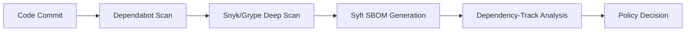

# GitActions-Security
# GitHub's DevSecOps Gaps and How to Bridge Them

GitHub has made significant strides in security, but several gaps remain for organizations pursuing mature DevSecOps practices.

---

## Table of Contents

- [Secret Management](#secret-management-gaps)
- [Dependency and Supply Chain](#dependency-and-supply-chain-vulnerabilities)
- [Infrastructure-as-Code Security](#infrastructure-as-code-security)
- [Container Image Security](#container-image-security)
- [Pipeline Security](#pipeline-security-github-actions)
- [SAST Limitations](#sast-limitations)
- [Runtime and DAST](#runtime-and-dast-gaps)
- [Policy Enforcement](#policy-enforcement-and-governance)
- [Audit and Compliance](#audit-and-compliance)

---

## Secret Management Gaps

GitHub's native secret scanning catches exposed credentials reactively, but it doesn't prevent secrets from being committed in the first place. The detection patterns, while extensive, miss custom or proprietary secret formats.

### Bridging the Gap

| Tool | Purpose |
|------|---------|
| [git-secrets](https://github.com/awslabs/git-secrets) | Pre-commit hook for AWS credentials |
| [truffleHog](https://github.com/trufflesecurity/trufflehog) | Scans repos for high-entropy strings and secrets |
| [gitleaks](https://github.com/gitleaks/gitleaks) | SAST tool for detecting hardcoded secrets |
| [HashiCorp Vault](https://www.vaultproject.io/) | Centralized secrets management |
| [AWS Secrets Manager](https://aws.amazon.com/secrets-manager/) | Cloud-native secrets storage |

> **Best Practice:** Implement pre-commit hooks that scan locally before code ever reaches the remote repository.

---

## Dependency and Supply Chain Vulnerabilities

Dependabot provides basic vulnerability alerts and automated PRs, but it lacks contextual prioritization—it treats all CVEs similarly without considering exploitability in your specific runtime context. It also doesn't cover all package ecosystems equally well, and there's no native SBOM generation.

### Bridging the Gap



**Recommended Tools:**

- **SCA Scanning:** [Snyk](https://snyk.io/), [Grype](https://github.com/anchore/grype), [Trivy](https://github.com/aquasecurity/trivy)
- **SBOM Generation:** [Syft](https://github.com/anchore/syft)
- **Dependency Management:** [GUAC](https://guac.sh/), [Dependency-Track](https://dependencytrack.org/)
- **Behavioral Analysis:** [Socket.dev](https://socket.dev/)

---

## Infrastructure-as-Code Security

GitHub doesn't natively scan Terraform, CloudFormation, or Kubernetes manifests for misconfigurations. You can commit an S3 bucket with public access or an overly permissive IAM policy without any warning.

### Bridging the Gap

**Example GitHub Actions Integration:**

```yaml
name: IaC Security Scan

on:
  pull_request:
    paths:
      - 'terraform/**'
      - 'k8s/**'

jobs:
  checkov:
    runs-on: ubuntu-latest
    steps:
      - uses: actions/checkout@v4
      
      - name: Run Checkov
        uses: bridgecrewio/checkov-action@v12
        with:
          directory: .
          framework: terraform,kubernetes
          output_format: sarif
          
      - name: Upload SARIF
        uses: github/codeql-action/upload-sarif@v3
        with:
          sarif_file: results.sarif
```

**Tools:**

| Tool | Coverage |
|------|----------|
| [Checkov](https://www.checkov.io/) | Terraform, CloudFormation, K8s, Helm, ARM |
| [tfsec](https://github.com/aquasecurity/tfsec) | Terraform-specific |
| [Trivy](https://github.com/aquasecurity/trivy) | Multi-purpose including IaC |
| [OPA/Conftest](https://www.conftest.dev/) | Custom policy enforcement |

---

## Container Image Security

GitHub Container Registry exists, but there's no built-in image scanning before pushing or at runtime. You can push vulnerable base images without friction.

### Bridging the Gap

**Recommended Architecture:**

```
┌─────────────────────────────────────────────────────────┐
│  GitHub Actions                                         │
│  ├── Build Image                                        │
│  ├── Trivy Scan (fail on CRITICAL/HIGH)                │
│  ├── Sign with Cosign                                   │
│  └── Push to Harbor                                     │
└─────────────────────────────────────────────────────────┘
                          │
                          ▼
┌─────────────────────────────────────────────────────────┐
│  Harbor Registry                                        │
│  ├── Deep vulnerability scan                            │
│  ├── Policy enforcement                                 │
│  ├── Signature verification                             │
│  └── SBOM storage                                       │
└─────────────────────────────────────────────────────────┘
                          │
                          ▼
┌─────────────────────────────────────────────────────────┐
│  Kubernetes                                             │
│  ├── Kyverno/Gatekeeper admission controller            │
│  ├── Verify signatures                                  │
│  └── Enforce Harbor-only pulls                          │
└─────────────────────────────────────────────────────────┘
```

**Tools:**

- [Trivy](https://github.com/aquasecurity/trivy) / [Grype](https://github.com/anchore/grype) / [Anchore](https://anchore.com/)
- [Harbor](https://goharbor.io/) — Enterprise container registry
- [Kyverno](https://kyverno.io/) / [Gatekeeper](https://github.com/open-policy-agent/gatekeeper) — Admission controllers

---

## Pipeline Security (GitHub Actions)

> ⚠️ **This is a significant gap.**

Actions workflows are susceptible to:
- Injection attacks through untrusted input
- Permission over-granting
- Third-party action supply chain risks
- Overly broad default `GITHUB_TOKEN` permissions
- No native provenance verification for marketplace actions

### Bridging the Gap

**1. Pin Actions to Commit SHAs**

```yaml
# ❌ Bad - tag can be moved
- uses: actions/checkout@v4

# ✅ Good - immutable reference
- uses: actions/checkout@b4ffde65f46336ab88eb53be808477a3936bae11
```

**2. Apply Least-Privilege Permissions**

```yaml
permissions:
  contents: read
  packages: write
  id-token: write  # For OIDC
```

**3. Use OIDC for Cloud Authentication**

```yaml
- name: Configure AWS Credentials
  uses: aws-actions/configure-aws-credentials@v4
  with:
    role-to-assume: arn:aws:iam::123456789012:role/GitHubActionsRole
    aws-region: us-east-1
```

**4. Implement Harden-Runner**

```yaml
- name: Harden Runner
  uses: step-security/harden-runner@v2
  with:
    egress-policy: audit  # or 'block'
    allowed-endpoints: >
      github.com:443
      api.github.com:443
      ghcr.io:443
```

**Additional Recommendations:**

- [ ] Run self-hosted runners in ephemeral, isolated environments
- [ ] Use [StepSecurity Secure Workflows](https://app.stepsecurity.io/) to audit existing workflows
- [ ] Implement branch protection requiring workflow approval for changes to `.github/workflows/`

---

## SAST Limitations

CodeQL (GitHub's native SAST) is powerful but has blind spots:
- Doesn't cover all languages equally
- Custom business logic flaws often slip through
- Can be slow on large codebases, causing developers to bypass it

### Bridging the Gap

| Approach | Tool | Use Case |
|----------|------|----------|
| Custom Rules | [Semgrep](https://semgrep.dev/) | Pattern-based rules for your codebase |
| Deep Analysis | [CodeQL](https://codeql.github.com/) | Data flow analysis |
| Commercial | [Checkmarx](https://checkmarx.com/), [SonarQube](https://www.sonarqube.org/) | Enterprise coverage |

**Strategy:**

```yaml
# Fast scan on PRs
on: pull_request
  # Run Semgrep (fast, custom rules)

# Comprehensive scan nightly
on:
  schedule:
    - cron: '0 2 * * *'
  # Run full CodeQL + commercial tools
```

---

## Runtime and DAST Gaps

GitHub provides no native:
- Dynamic application security testing (DAST)
- API security scanning
- Runtime protection

### Bridging the Gap

**DAST Integration Example:**

```yaml
name: DAST Scan

on:
  deployment:
    types: [completed]

jobs:
  zap-scan:
    runs-on: ubuntu-latest
    if: github.event.deployment.environment == 'staging'
    steps:
      - name: OWASP ZAP Full Scan
        uses: zaproxy/action-full-scan@v0.8.0
        with:
          target: 'https://staging.example.com'
          rules_file_name: '.zap/rules.tsv'
```

**Tools by Category:**

| Category | Tools |
|----------|-------|
| DAST | [OWASP ZAP](https://www.zaproxy.org/), [Nuclei](https://github.com/projectdiscovery/nuclei), [Burp Suite](https://portswigger.net/burp) |
| API Security | [StackHawk](https://www.stackhawk.com/), [42Crunch](https://42crunch.com/) |
| Runtime Protection | [Falco](https://falco.org/), [Sysdig](https://sysdig.com/), [Aqua](https://www.aquasec.com/) |

---

## Policy Enforcement and Governance

Branch protection rules exist but are coarse-grained. There's no native way to:
- Enforce that security scans must pass before merge
- Require specific reviewers for security-sensitive paths
- Mandate signed commits organization-wide without manual configuration

### Bridging the Gap

**GitHub Rulesets (Recommended):**

Use [repository rulesets](https://docs.github.com/en/repositories/configuring-branches-and-merges-in-your-repository/managing-rulesets/about-rulesets) for organization-wide policy enforcement.

**Automated Governance Tools:**

- [Allstar](https://github.com/ossf/allstar) — Automated repository security posture management
- [Legitify](https://github.com/Legit-Labs/legitify) — Detect misconfigurations across GitHub orgs

**Example CODEOWNERS for Security Review:**

```plaintext
# .github/CODEOWNERS

# Security team must review workflow changes
.github/workflows/    @security-team

# Security review for auth-related code
/src/auth/           @security-team
/src/crypto/         @security-team

# Infrastructure changes require platform team
/terraform/          @platform-team @security-team
```

---

## Audit and Compliance

GitHub's audit logs exist but lack depth for forensic investigation. There's no native compliance mapping to frameworks like SOC2, FedRAMP, or PCI-DSS.

### Bridging the Gap

**Stream Audit Logs to SIEM:**

```yaml
# Example: GitHub → S3 → Splunk
name: Export Audit Logs

on:
  schedule:
    - cron: '0 * * * *'  # Hourly

jobs:
  export:
    runs-on: ubuntu-latest
    steps:
      - name: Fetch Audit Logs
        env:
          GH_TOKEN: ${{ secrets.AUDIT_LOG_TOKEN }}
        run: |
          gh api /orgs/{org}/audit-log \
            --paginate \
            -X GET \
            -f phrase="created:>=$(date -d '1 hour ago' -Iseconds)" \
            > audit-logs.json
            
      - name: Upload to S3
        run: |
          aws s3 cp audit-logs.json s3://security-logs/github/
```

**Compliance Tools:**

| Tool | Purpose |
|------|---------|
| [Drata](https://drata.com/) | Continuous compliance automation |
| [Vanta](https://www.vanta.com/) | SOC2, HIPAA, ISO 27001 automation |
| [Splunk](https://www.splunk.com/) | SIEM, correlation, alerting |

---

## Summary

| Gap | Native GitHub | Recommended Solution |
|-----|---------------|---------------------|
| Secret Management | Reactive scanning | Pre-commit hooks + Vault |
| Supply Chain | Basic Dependabot | Snyk + Syft + Dependency-Track |
| IaC Security | ❌ None | Checkov + OPA |
| Container Security | ❌ None | Harbor + Trivy + Admission Controllers |
| Pipeline Security | Basic | SHA pinning + OIDC + Harden-Runner |
| SAST | CodeQL | + Semgrep for custom rules |
| DAST/Runtime | ❌ None | ZAP + Falco |
| Policy Governance | Basic branch rules | Rulesets + Allstar |
| Audit/Compliance | Basic logs | SIEM integration + Drata/Vanta |

---

## Key Takeaway

> GitHub provides foundational security capabilities, but a mature DevSecOps practice requires layering specialized tools, shifting security left with pre-commit checks, and extending right into runtime. The key is making these additions **frictionless for developers**—security gates that block without context or remediation guidance get bypassed.

---

## Additional Resources

- [OpenSSF Scorecard](https://securityscorecards.dev/) — Automated security health checks
- [SLSA Framework](https://slsa.dev/) — Supply chain integrity levels
- [OWASP DevSecOps Guideline](https://owasp.org/www-project-devsecops-guideline/)
- [CIS GitHub Benchmark](https://www.cisecurity.org/benchmark/github)
